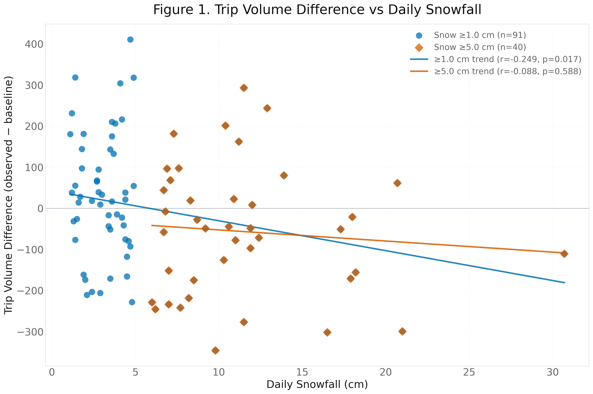
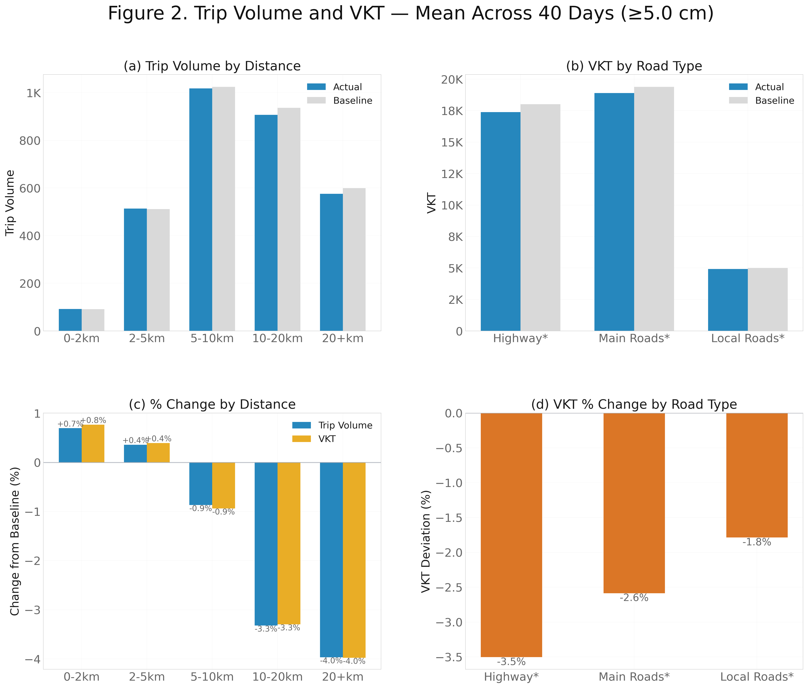
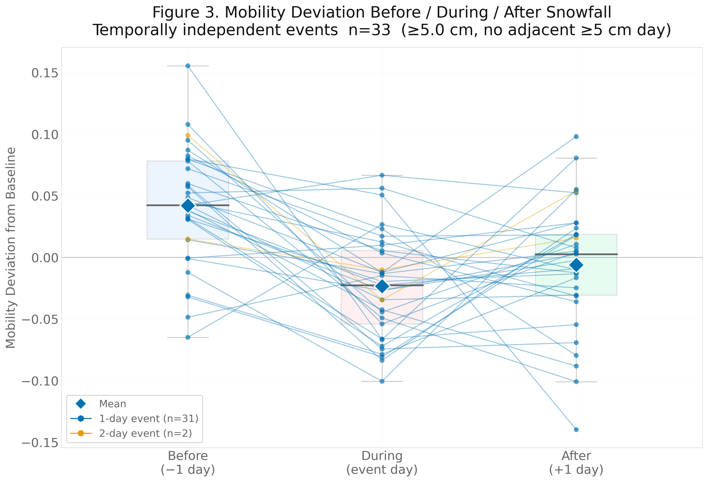

# Open Code Supplement — "Mobility Responses to Snowfall in the Greater Toronto Area"

**Zhou, H. & Long, J.**  
Department of Geography & Environment, Western University  

---

## Overview

This folder contains the complete analysis code used to produce the three
publication figures reported in the paper, together with a synthetic dataset
that allows any reader to run the code end-to-end without access to the
proprietary mobility data.

| Figure | Content | Events used |
|--------|---------|-------------|
| **Fig 1** | Scatter: aggregate trip volume difference vs daily snowfall | All ≥1 cm and ≥5 cm snow days |
| **Fig 2** | Four-panel VKT analysis by distance bin and road type | All major snow days (≥5 cm) |
| **Fig 3** | Three-point temporal plot: Before / During / After snowfall | Temporally independent ≥5 cm events |

> **Note:** The figures below are generated from the included **synthetic dataset** (100 OD pairs), not the proprietary mobility data used in the paper. Layout, methodology, and qualitative patterns are identical; absolute trip volumes and axis scales differ.







---

## Repository layout

```
findings-open-code/
├── README.md                    ← this file
├── requirements.txt             ← Python dependencies
├── generate_synthetic_data.py   ← creates the sample dataset from scratch
├── config.py                    ← shared configuration (thresholds, paths, style)
├── utils.py                     ← data loading and analysis functions
├── paper_figures.py             ← generates Figures 1–3 and Table 1 statistics
└── synthetic_data/              ← created by generate_synthetic_data.py
    ├── od_mobility_synthetic.parquet
    └── snow_sessions_synthetic.json
```

---

## Quick start

```bash
cd findings-open-code

# 1. Install dependencies
pip install -r requirements.txt

# 2. Generate the synthetic dataset (takes ~30 seconds)
python generate_synthetic_data.py

# 3. Produce Figures 1–3 and print Table 1 statistics
python paper_figures.py
# → paper_outputs/fig1_scatter.png
# → paper_outputs/fig2_vkt.png
# → paper_outputs/fig3_temporal.png
```

---

## Data

### Synthetic dataset (included)

Because the origin-destination mobility data is proprietary and
cannot be redistributed, this supplement ships a **synthetic dataset**
generated by `generate_synthetic_data.py`.  The synthetic data

- has the **same schema** as the real dataset,
- has the **same date range** (2021-08-02 – 2025-12-30),
- embeds snow-suppression and pre-event anticipatory effects at magnitudes
  consistent with the paper's reported values, but these are **imposed by
  construction** — they are not independent measurements.

**The synthetic dataset should not be interpreted as evidence.** It exists
to let readers verify the code logic and reproduce the figure layout.

#### Synthetic vs real — key differences

| Property | Synthetic | Real |
|----------|-----------|------|
| OD pairs | 100 | ~552,000 |
| Total rows | ~320,000 | ~68,000,000 |
| File size | ~5 MB | ~785 MB |
| Daily trip volume | ~6,000 (synthetic pairs only) | ~5,000,000 (GTA population sample) |
| Snow effects | Embedded by design | Empirically measured |

Figure axes will therefore show different absolute scales than the paper.
All percentage deviations (Figures 2c, 2d, 3 y-axis) are unaffected.

### Real dataset schema

Researchers wishing to replicate the study with their own OD mobility data
need a Parquet file with **at minimum** the following columns.

#### Mobility columns (used for Figures 1 and 3)

| Column | Type | Description |
|--------|------|-------------|
| `bucket_start` | Datetime | Start of 12-hour bucket (UTC) |
| `weather_label` | Str | `"Snow"` or `"Clear"` (or similar) |
| `count` | Int16 | Observed OD trip count |
| `baseline` | Float64 | Expected trip count (e.g., 9-week rolling median matched by OD pair, day-of-week, and bucket) |
| `has_snow` | Boolean | Active snowfall during this bucket |
| `snow_on_ground_cm` | Float64 | Snow depth on ground (cm) |
| `total_snow_cm` | Float64 | Daily snowfall accumulation (cm) — **same value for all rows on the same calendar day** |

#### Additional columns (used for Figure 2 VKT analysis)

| Column | Type | Description |
|--------|------|-------------|
| `total_distance_km` | Float64 | Route length for this OD pair (km) |
| `motorway_km` | Float64 | Distance on motorway-class roads (km) |
| `trunk_km` | Float64 | Distance on trunk roads (km) |
| `primary_km` | Float64 | Distance on primary roads (km) |
| `secondary_km` | Float64 | Distance on secondary roads (km) |
| `tertiary_km` | Float64 | Distance on tertiary roads (km) |
| `residential_km` | Float64 | Distance on residential roads (km) |
| `unclassified_km` | Float64 | Distance on unclassified roads (km) |

Route distances and road-type breakdowns were obtained from the Open Source
Routing Machine (OSRM) with OpenStreetMap data for Ontario.

### Snow session JSON schema

`snow_sessions_synthetic.json` (and its real-data counterpart) lists
consecutive snow-day groups, pre-computed before analysis:

```json
{
  "sessions": [
    {
      "session_number": 1,
      "start_date": "2021-11-15T00:00:00",
      "end_date":   "2021-11-16T00:00:00",
      "duration_days": 2
    }
  ]
}
```

Sessions should span all consecutive days where daily snowfall exceeds the
minor-snow threshold (≥1 cm by default).  The analysis code then filters
internally to the major-snow threshold (≥5 cm) and the temporal-independence
criterion applied in Figure 3.

---

## Code structure

### `config.py` — shared configuration

Defines all analysis constants, file paths, and matplotlib style.  Swap the
two data paths to point at your own dataset:

```python
DATA_PARQUET       = Path("synthetic_data/od_mobility_synthetic.parquet")
SNOW_SESSIONS_JSON = Path("synthetic_data/snow_sessions_synthetic.json")
```

Constants that control which events are included:

| Constant | Value | Meaning |
|----------|-------|---------|
| `MIN_SNOW_CM` | 5.0 | Major snowfall threshold (cm) |
| `ANY_SNOW_CM` | 1.0 | Minor snowfall threshold (cm) |
| `LEAD_DAYS` | 1 | Pre/post window for Figure 3 |
| `BUCKET_HOURS` | 12 | Temporal resolution of mobility data (h) |

### `utils.py` — data loading and analysis functions

| Function | Description |
|----------|-------------|
| `load_data()` | Loads Parquet + JSON, returns `(df, event_ranges)` |
| `compute_daily_deviation(df, date)` | Daily mobility deviation (%) for one calendar day |
| `compute_window_deviation(df, anchor, W, dir)` | Mean deviation over W days before/after anchor |
| `collect_session_events(event_ranges, df, ...)` | Session-level pre/during/post deviations |
| `build_daily_snow_map(df)` | `{date: snowfall_cm}` lookup dictionary |
| `filter_independent_events(session_df, snow_map, ...)` | Temporal independence filter |
| `paired_ttest(a, b)` | Paired t-test with Cohen's d |
| `brown_forsythe(*groups)` | Brown-Forsythe variance equality test |

**Mobility deviation** is defined at the bucket level and then averaged
across buckets within a day:

```
deviation_bucket = (observed_count − baseline_count) / baseline_count
deviation_day    = mean(deviation_bucket) over all 12-hour buckets
```

**Baseline** in the real data: 9-week rolling window median (4 weeks before
and 4 weeks after the target date), matched by OD pair, day of week, and
12-hour bucket.  In the synthetic dataset the baseline is the "clean"
expected volume (no snow effect, no noise) pre-computed at generation time.

### `paper_figures.py` — figure generation

Produces all three figures and prints Table 1 statistics.  The script is
self-contained: run `python paper_figures.py` from this directory.

---

## Analysis methodology

### Study area and data period

- **Geography**: Greater Toronto Area (GTA), Ontario, Canada
- **Mobility data period**: 2021-08-02 – 2025-12-30
- **Weather data**: NAVCAN Toronto Pearson (WMO station 71624), daily
  snowfall from Environment and Climate Change Canada (ECCC)
- **OD unit**: Aggregated Dissemination Areas (ADAs); 744 in the GTA

### Snow event classification

Two snowfall thresholds are used:

| Threshold | Label | n days (real data) | Rationale |
|-----------|-------|--------------------|-----------|
| ≥ 1 cm | Any snow | ~96 | Detectable snowfall |
| ≥ 5 cm | Major snow | ~37 | City of Toronto residential plowing trigger |

### Baseline and deviation

The **baseline** for each OD pair is its expected trip count matched by
day-of-week and 12-hour bucket, computed as the median over a 9-week
rolling window centred on the target date (excluding the target day itself).
Mobility deviation is the percentage difference between observed and baseline:

```
deviation (%) = (count − baseline) / baseline × 100
```

### Temporally independent events (Figure 3)

Major snow events are grouped into "sessions" (consecutive ≥5 cm days).
A session is **temporally independent** if neither the day before the
session start nor the day after the session end records ≥5 cm snowfall.
This ensures that the "before" and "after" windows reflect genuinely
snow-free mobility rather than adjacent storm periods.

In the real data, 23 of the qualifying sessions (n=37 event-days) meet
this criterion.

### Statistical tests (Table 1)

For each pair of temporal zones (Before vs During, During vs After,
Before vs After):

- **Paired t-test** with one deviation value per independent event
- **Cohen's d** = mean(difference) / sd(difference)
- **Brown-Forsythe** (Levene with center=median) for variance homogeneity

---

## Reproducing with your own data

1. Prepare your mobility Parquet with the column schema above.
2. Prepare the snow sessions JSON using consecutive-day grouping.
3. Edit `config.py` to point `DATA_PARQUET` and `SNOW_SESSIONS_JSON`
   at your files.
4. Run `python paper_figures.py`.

No other changes are needed — all analysis logic is data-agnostic.

---

## Software environment

```
Python  ≥ 3.10
polars  ≥ 0.20
numpy   ≥ 1.24
scipy   ≥ 1.11
matplotlib ≥ 3.7
pandas  ≥ 2.0     (used for intermediate aggregation in Figure 2)
```

Install with:

```bash
pip install -r requirements.txt
```

A conda environment file is not included; any standard scientific Python
distribution (Anaconda, Miniforge) with the packages above will work.

---

## Citation

If you use this code or the methodology in your own research, please cite:

> Zhou, Haorui, and Jed A Long. 2026. “Mobility Responses to Snowfall in the GreaterToronto Area.” Findings. https://doi.org/10.32866/001c.162965.

---

## License

Code in this folder is released under the **MIT License**.  
The synthetic dataset (`synthetic_data/`) is released under **CC0 1.0 Universal**
(public domain dedication).  
The proprietary mobility data is not included and cannot be redistributed.
