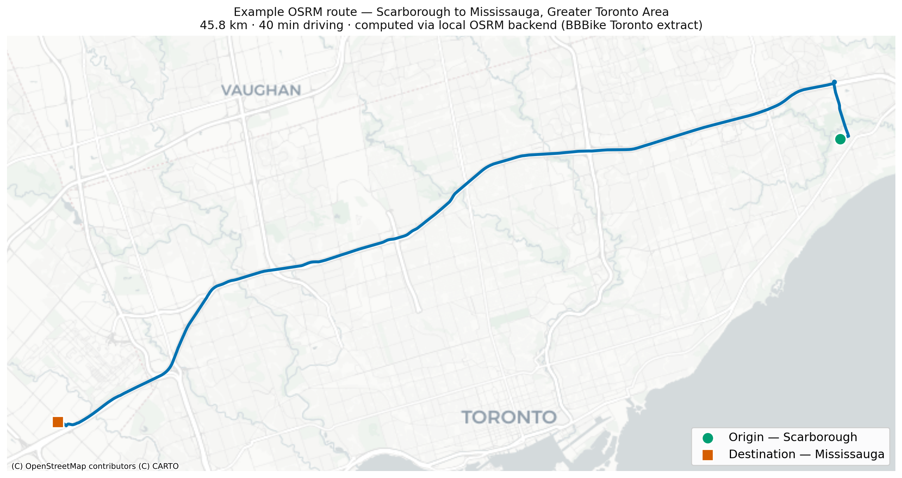

# Routing Pipeline

Computes per-OD-pair route distances and road-type breakdowns used in the
VKT analysis (Figure 2). Routes are computed with OSRM; road classifications
are resolved against a local Overpass API instance.



*Single OSRM route between Scarborough and Mississauga (~46 km).
In the study this pipeline was run for all valid ADA origin-destination pairs across the GTA,
producing the `total_distance_km` and per-road-type km columns used in the VKT analysis.*

## Architecture

```
16 × OSRM backends (ports 5000–5015)   ←─ Ontario OSM
         ↓  parallel round-robin
   compute_routes.py
         ↓  node IDs per route segment
   Overpass API (port 12345)            ←─ Ontario OSM
         ↓  highway tags
   routing_results.parquet
```

## Setup

### 1. Download and pre-process Ontario OSM data

```bash
cd routing/

# Download the Ontario extract (~400 MB)
wget https://download.geofabrik.de/north-america/canada/ontario-latest.osm.pbf

# Pre-process for OSRM (MLD algorithm — one-time, takes ~5–10 min)
docker run -t -v "$(pwd):/data" osrm/osrm-backend \
    osrm-extract -p /opt/car.lua /data/ontario-latest.osm.pbf
docker run -t -v "$(pwd):/data" osrm/osrm-backend \
    osrm-partition /data/ontario-latest.osrm
docker run -t -v "$(pwd):/data" osrm/osrm-backend \
    osrm-customize /data/ontario-latest.osrm
```

### 2. Start OSRM instances

```bash
docker compose -f docker-compose-osrm.yml up -d
# Verify: curl http://localhost:5000/route/v1/driving/-79.38,43.65;-79.50,43.70
```

### 3. Start Overpass API

On first run, change `OVERPASS_MODE=serve` to `OVERPASS_MODE=init` in
`docker-compose-overpass.yml` to build the database (~30 min), then switch
back to `serve` and restart.

```bash
docker compose -f docker-compose-overpass.yml up -d
# Verify: curl "http://localhost:12345/api/interpreter?data=[out:json];node(1);out;"
```

### 4. Run the routing computation

```bash
pip install geopandas pandas shapely tqdm requests
python compute_routes.py
```

Output: `routing_results.parquet` — one row per route variant with
`total_distance_km` and per-road-type `*_dist_km` columns.

## Files

| File | Purpose |
|------|---------|
| `docker-compose-osrm.yml` | 16 parallel OSRM backends |
| `docker-compose-overpass.yml` | Local Overpass API for road-type lookup |
| `osrm_tools.py` | `get_route()`, `get_ways_for_nodes()`, `analyze_route()` |
| `compute_routes.py` | Batch processor — iterates ADA pairs, distributes across OSRM instances |

## Notes

- **Why 16 instances?** OSRM is single-threaded per process. 16 instances
  fully saturate a 16-core machine when processing ~218,000 OD pairs.
- **Why Overpass?** OSRM returns OSM node IDs but not highway tags. Overpass
  resolves which way each node belongs to and what road type it is.
- The Ontario OSM extract is used for both OSRM and Overpass — they must be
  from the same download to keep node IDs consistent.
